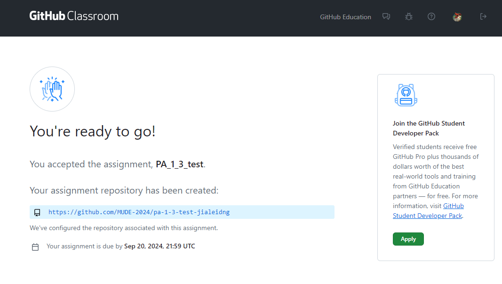
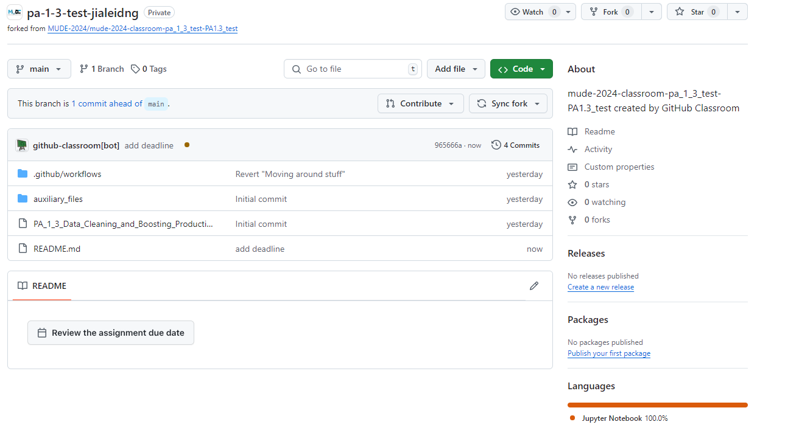
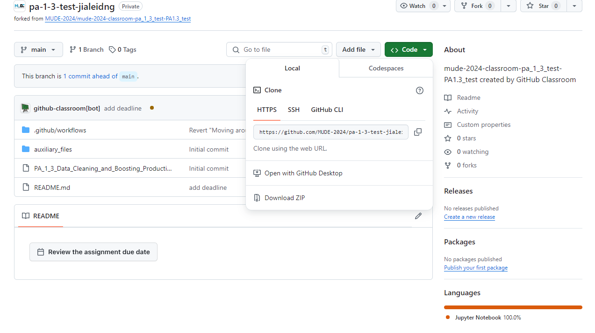
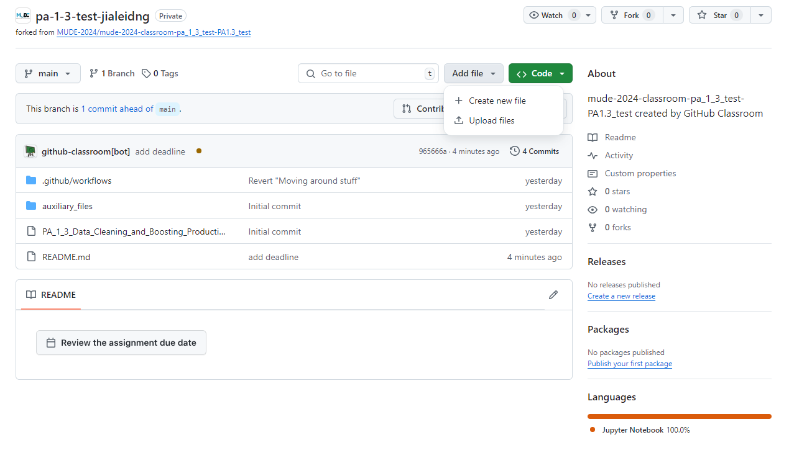
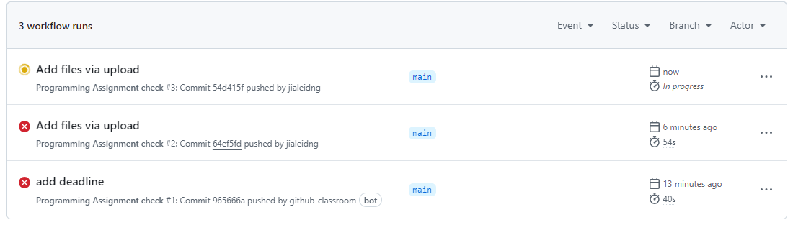
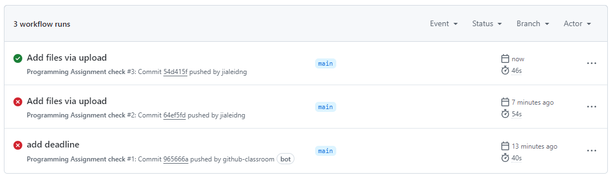
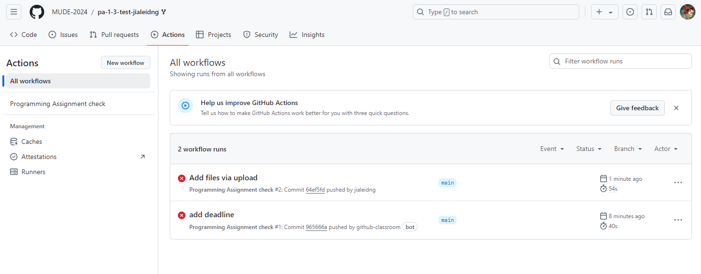

# PA 1.3: A Mixed Bag

*[CEGM1000 MUDE](http://mude.citg.tudelft.nl/): Week 1.3. Due: before Friday, September 20, 2024.*

**Remember: this is the first PA that is part of your grade for the Assignment Portfolio!**

_Instructions for turning in this assignment are included in this `README.md` file._

## Introduction

This PA consists of 2 parts:

1. A short online survey to check in with how you are doing with Programming topics in MUDE.
2. Complete the Tasks described in the notebook `PA_1_3_Data_Clearning_and_Boosting_Productivity.ipynb`

Note that you will also need a GitHub account to access the assignment (instructions below).

### Passing the PA

Remember that all PA's are assessed on a pass/no-pass basis. You are very strongly encouraged to complete the PA before the Friday session, as it contains useful content for the Group Assignments. However, you are able to correct and re-submit your work up until the Monday of Week 1.9, by 12:00 (October 28).

Depending on the scope of the PA, each one will have different criteria for earning a passing grade.

You will pass PA 1.3 if:
1. You complete the survey (see link above)
2. Your notebook `PA_1_3_Data_Clearning_and_Boosting_Productivity.ipynb` is able to run without errors

That's it! The instructions in this README tell you:
1. How to access the assignment
2. How to submit the assignment
3. How to check that your notebook passed

## Step 1: Create a GitHub Account

**This is the first thing you should do for PA 1.3, as you will need to tell us your account username to complete the survey.**

To access the assignments, you will need to **create a GitHub account.** Here are a few notes about setting up an account:
- You can use an existing account if you already have one.
- You are free to choose any user name you like.
- Your account is not required to be connected in any way to your student email or NetId.
- In fact, we recommend using your personal email, as then you will be able to keep your files long after you graduate from TU Delft!

To create an account, simply go to [github.com](https://github.com/) and click "Sign Up."

## Complete the Survey

Once you have a GitHub account, you can complete the survey using [this link](https://forms.office.com/e/saRwPUyL8d).

## How to Access the Assignment

Once you have a GitHub account, you are able to Access the assignment by clicking on this link and following the steps described below:

Link to accept PA 1.3: 

1. Click the link
2. Authorize GitHub Access
3. Join the classroom and identify yourself by finding your Student ID Number in the list of "Identifiers". If your ID is not there, you can "skip this step" (username will be used for repo name)
4. Click "Accept this assignment"
5. you will see a link that looks like this: `http://github.com/MUDE-2024/....` save the link or bookmark it so you can find it later, then click on the link

You have now opened up a repository on GitHub. We will learn more about Git, GitHub and repositories next week. For now, we will simply be using it as a place to download and upload files (and check that your notebook has passed).

To work on the assignment, you are expected to first **download** the files, then work in the notebook. When you have finished the activities, save your work in VS Code, then proceed to the next section (submitting the assignment).

To **download** the assignment:

1. Click the green "Code" button
2. At the bottom of the popup window, select "Download ZIP"
3. Unzip the file on your computer; the unzipped folder will be your working directory for PA 1.3 and contains all necessary files.

## How to Submit the Assignment

To submit your notebook, return to the repository using the link you saved above when accepting it. Then:

1. Click the "Add file" button and then select "Upload Files"
2. Drag the file you changed (should be the notebook) to the appropriate box, or find it using the "Browse" feature.
3. Once the file is there you don't have to edit any text (e.g., the commit messages)
4. Simply click the green "Commit Changes" button.
5. That's it!

## How to Check that your Notebook Passed

To see if your notebook passed:

1. Start in the home page of your PA 1.3 repository (should be taken there automatically after you submit the file).
2. Click on the "Actions" tab near the top center of the page.
3. If you recently uploaded a file you should see a yellow dot. This means your submission is being checked; it will change after the checking process is completed.

If the dot turns green, your notebook passes.

If the dot turns red with an "x" it means your notebook does not meet the requirements. If this happens, you should check your notebook (on your computer) for errors and re-submit it using the process described above.

### PA 1.3 Passing Criteria (Reminder)

For this week, note two things:

1. you will pass the assignment PA 1.3 when the dot is green AND you have completed the survey (this will not be automatically cehcked)
2. the dot turns green if you fix all the cells in your notebook so that they run without errors

**End of file.**

&copy; Copyright 2024 <a rel="MUDE" href="http://mude.citg.tudelft.nl/">MUDE</a>, TU Delft. This work is licensed under a <a rel="license" href="http://creativecommons.org/licenses/by/4.0/">CC BY 4.0 License</a>.